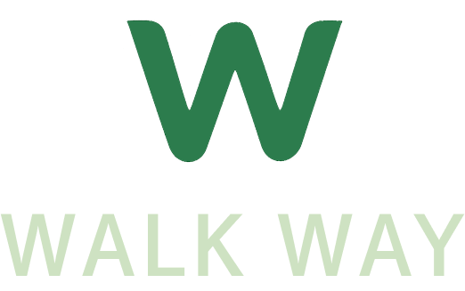

# WalkWay

공공 CCTV Open API를 활용한 안전 산책 서비스 기획 프로젝트입니다.  
정부 공공데이터 활용 공모전을 계기로 시작한 개인 프로젝트로,  
산책 기록과 안전 요소를 결합한 모바일 서비스를 구현하였습니다.



## 기획 배경

- **문제 인식**: 산책 시 안전한 경로에 대한 정보 부족과 체계적인 운동 기록 관리의 필요성
- **초기 아이디어**: 공공 CCTV 데이터를 활용하여 안전한 산책 환경을 제공하고자 기획
- **사회적 맥락**: 정부 공공데이터 활용 공모전 참여를 통해 공공 데이터의 실생활 적용 가능성 탐구
- **목표**: CCTV 밀집도를 기반으로 안전 공원을 추천하고 개인 맞춤형 산책 서비스 구현

## 주요 기능

### 1. 산책 모드 선택
- **즐거운 산책하기**: 위치 기반 근처 안전 공원 추천 및 선택
- **건강한 산책하기**: 개인 정보(나이, 키, 몸무게) 입력 후 맞춤형 건강 관리

### 2. 안전 공원 탐색 기능
- 공공 CCTV Open API 데이터 연동
- 공원별 CCTV 개수 및 가로등 정보 시각화
- 사용자 위치 기반 거리순 정렬
- 실시간 지도상 공원 위치 표시

### 3. 산책 기록 및 추적
- GPS 기반 실시간 경로 추적
- 걸음 수, 거리, 칼로리, 소요시간 자동 계산
- 사진 첨부 및 메모 기능
- 달력 기반 산책 기록 조회

### 4. 개인화된 건강 데이터
- 사용자별 BMI 기반 권장 칼로리 계산
- 운동 강도에 따른 개인 맞춤형 피드백
- 산책 기록 데이터 축적 및 분석

## Tech Stack

**Frontend**
- React Native (Expo Router)
- TypeScript
- React Native Maps
- Expo Location & Sensors
- AsyncStorage

**Backend**
- Node.js / Express
- MongoDB (Mongoose)
- RESTful API

**Data Source**
- 공공 CCTV Open API
- 공공 가로등 Open API

**Development Tools**
- Expo CLI
- VS Code
- Git

## 기술적 도전

### 1. 공공 데이터 한계와 기획 수정
**문제**: Open API에서 CCTV 개수 정보만 제공되고 정확한 위치 좌표 부족  
**해결**: 초기 기획의 '실시간 안전 경로 추천' 기능을 '안전 공원 선택' 기능으로 수정  
**학습**: 기획 단계에서 데이터 소스의 제공 범위를 면밀히 분석해야 함

### 2. 모바일 센서 데이터 연동 복잡성
**문제**: iOS 건강 데이터 접근 권한 및 Expo Pedometer API의 제한사항  
**해결**: 대안으로 GPS 기반 거리 계산과 수동 걸음 수 입력 방식 병행  
**학습**: 플랫폼별 권한 정책과 API 제한사항을 사전에 고려한 설계 필요

### 3. 이미지 저장 구조 설계
**문제**: 초기 로컬 URI 기반 저장으로 인한 데이터 영속성 문제  
**해결**: 현재는 로컬 저장 방식으로 구현, 추후 서버 기반 저장 방식으로 개선 예정  
**학습**: 데이터 저장 아키텍처는 확장성을 고려하여 초기에 설계해야 함

### 4. 지도 기반 UX 최적화
**문제**: 공원 목록과 지도 연동 시 사용자 경험 개선 필요  
**해결**: 카드 스와이프와 지도 마커 동기화, 부드러운 자동 스크롤 구현  
**학습**: 지도 기반 앱에서는 시각적 피드백과 인터랙션 연결이 핵심

## 프로젝트 구조

```
├── mobile/my-app/          # React Native 모바일 앱
│   ├── app/               # Expo Router 페이지
│   ├── components/        # 공통 컴포넌트
│   ├── constants/         # API 설정 및 테마
│   └── assets/           # 이미지, 폰트 리소스
└── server/               # Node.js 백엔드 서버
    ├── models/           # MongoDB 스키마
    ├── routes/           # API 라우트
    └── scripts/          # 데이터 처리 스크립트
```

## 배운 점

### 기술적 성장
- **React Native**: 크로스플랫폼 개발 경험과 네이티브 모듈 활용법 습득
- **지도 API**: React Native Maps를 통한 위치 기반 서비스 구현 경험
- **NoSQL**: MongoDB를 활용한 GeoJSON 기반 지리 데이터 처리 및 쿼리 최적화
- **API 설계**: RESTful 원칙을 따른 백엔드 API 구조 설계 및 구현

### 프로젝트 관리
- **기획 유연성**: 기술적 제약을 발견했을 때 빠른 기획 수정의 중요성 인식
- **데이터 분석**: 공공 데이터 활용 시 제공 범위와 품질 사전 분석의 중요성
- **사용자 경험**: 모바일 앱에서 직관적인 네비게이션과 피드백의 중요성 체험
- **개발 프로세스**: 개인 프로젝트에서도 체계적인 코드 구조 관리의 필요성

### 문제 해결 능력
- 제한된 API 데이터로 대안 기능 설계 능력 향상
- 플랫폼별 제약사항을 고려한 크로스플랫폼 개발 전략 수립
- 실시간 데이터 처리와 UI 동기화 최적화 경험 축적

## 향후 개선 방향

### 기술적 개선
- **클라우드 스토리지**: AWS S3 기반 이미지 저장 구조로 전환
- **실시간 데이터**: WebSocket을 활용한 실시간 산책 데이터 동기화
- **AI 추천**: 개인 산책 패턴 분석 기반 맞춤형 공원 추천 알고리즘

### 기능 확장
- **소셜 기능**: 산책 기록 공유 및 친구와의 산책 챌린지
- **상세 분석**: CCTV 위치 좌표 기반 경로별 위험도 시각화
- **건강 연동**: Apple Health / Google Fit 연동으로 종합 건강 관리

### 사용성 개선
- **오프라인 모드**: 네트워크 없이도 기본 기능 사용 가능한 구조
- **접근성**: 시각/청각 장애인을 위한 접근성 기능 추가
- **다국어**: 국제화(i18n) 지원으로 다양한 사용자층 확대

---

**개발 기간**: 2024년 하반기  
**참여 공모전**: 정부 공공데이터 활용 공모전  
**개발자**: 개인 프로젝트
